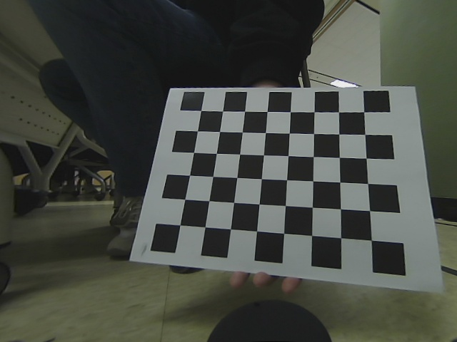

# Camera-Calibration using Ceres Solver
This repository contains an implementation of camera intrinsic calibration for optics and fisheye distortion models.

For fisheye distortion models, instead of using the calibrate function in the OpenCV library, this implementation uses Ceres Solver.

## Dependencies
- CMake
- OpenCV
- Ceres Solver
- yaml-cpp

## build
```bash
mkdir build && cd build
cmake .. 
make
```

## calibration

```bash
./camera_intrinsic ../resources/checkerboard fisheye 8 6 2.75
```

## save undistorted image

```bash
./save_undist ../resources/checkerboard ../result/intrinsic.yaml
```


## Result


